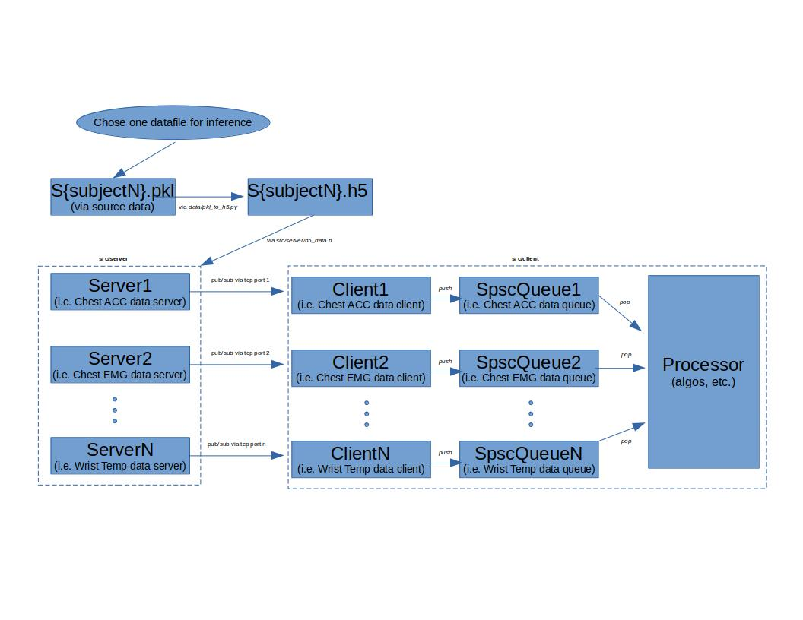

# wesad-live
Demo of "real" time wesad processing algorithms. Biological chest/wrist sensor data stream simulated via live feed to processor from separate servers.
https://archive.ics.uci.edu/ml/datasets/WESAD+%28Wearable+Stress+and+Affect+Detection%29

- [x] Server Send Data
- [x] Client Recv Data
- [ ] Proc Algos
## requirements:
* hdf5 c-api thread-safe
* zmq cpp-api
* boost (currently using 1.76.0)
